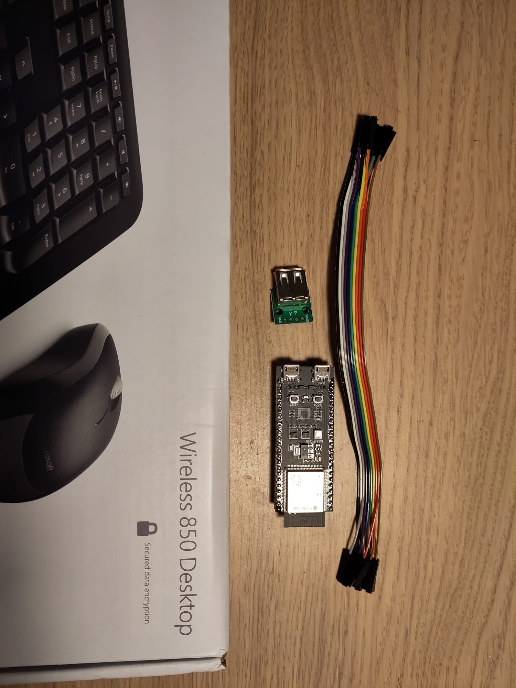

| Supported Targets |  ESP32-S3 |
| ----------------- |  -------- |

# USB to BLE HID converter.
## The problem
I have two laptops and a desktop (with a monitor) on my table. (Mixed OS - Linux and Windows.)
I want to have a single keyboard and mouse, connected wirelessly to all of the computers, and using a hot-key, select the computer I am working on.

## The solution
Connect the wireless keyboard/mouse to a USB and BLE capable ESP32-S3 DevkitC-1. Use the ESP32S3 to implement a BLE HID device that transmits the HID reports from the attached keyboard and mouse.
Connect all my computers to the same BLE HID device.
### the firmware
The firmware functions in the following manner.
* Accepts connections from hosts
* Maintains a reference to a single active-host
* Relays keyboard/mouse reports to the active-host
* detect a hot key combination, and based on the input, select another active-host to receive HID input.

## Hardware used
* Development board with USB capable ESP SoC (ESP32-S3-DevkitC-1)
* A USB cable for Power supply and programming
* A USB-A port and some wires
* Microsoft Wireless 850 desktop (USB wireless keyboard/mouse connected wirelessly to a single USB dongle)

### Common Pin Assignments
If your board doesn't have a USB A connector connected to the dedicated GPIOs, 
you may have to DIY a cable and connect **D+** and **D-** to the pins listed below.

```
ESP BOARD    USB CONNECTOR (type A)
                   --
                  | || VCC
[GPIO19]  ------> | || D-
[GPIO20]  ------> | || D+
                  | || GND
                   --
```

## Build and Flash
Build the project and flash it to the board:

```
idf.py -p PORT build flash
```

## Using the device
1. Connect the wireless keyboard/mouse USB dongle to the evaluation board and power on the board.
2. bonding a device to a computer: The device does not require interaction. Use the bluetooth connect method from your computer settings.
3. Automatically reconnecting with Linux: To enable a Linux computer to automatically reconnect to the keyboard/mouse on startup, The user must make the device a trusted-device. It can be done from the command line using the command ``` bluetoothctl trust <device bluetooth address>``` where bluetooth address  is in the format AA:BB:CC:DD:EE:FF.
4. routing the keyboard/mouse to a specific connected device: By default, the first connected device is marked as the "active client". To switch between clients use the following key combinations:

| Left Ctrl + Left Alt + Left shift + left arrow | Next client |
| Left Ctrl + Left Alt + Left shift + right arrow | Previous client |
|-------------------------------------------------|-----------------|

### Supported clients (tested)
Dell XPS 15" - Windows 11
Framework laptop 13" - Linux (Ubuntu 22.04)
Intel NUC - Linux (Ubuntu 22.04)

## Development notes
The firmware was developed based on three of the examples from esp-idf 5.5.1.
* esp-idf/examples/peripherals/usb/host/hid
* sp-idf/examples/bluetooth/esp_hid_device
* esp-idf/examples/bluetooth/bluedroid/ble/ble_hid_device_demo
### Supporting multiple connections
The project uses a modified version of the "esp_hid" component, named "esp_hid_multi_conn" which is part of the project.
The changes apply only to the BLE advertiser part of this component, and were not implemented for classic Bluetooth.
